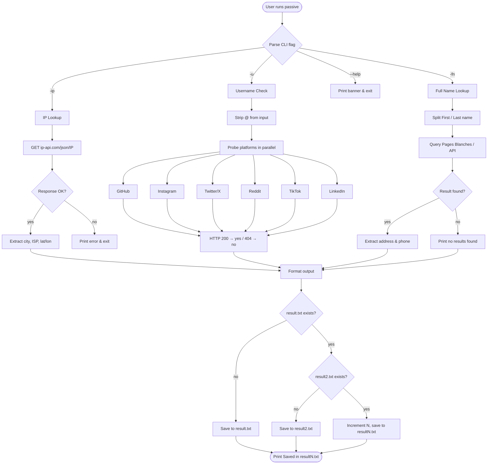
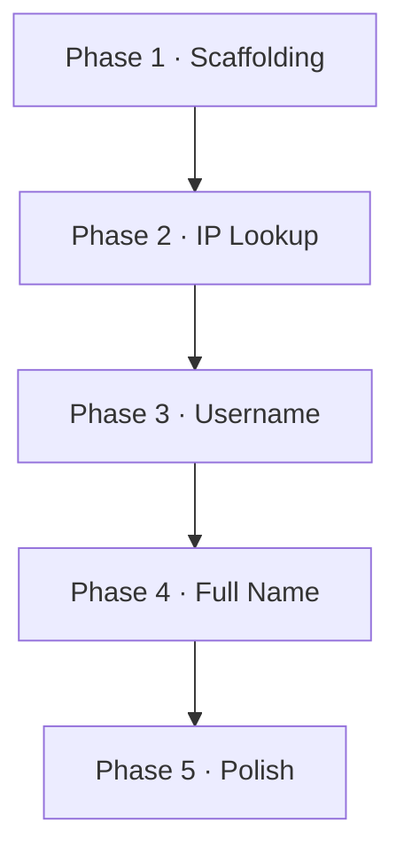

# Passive OSINT Tool — Implementation Plan

## Language
**Python 3** — best ecosystem for OSINT: `requests`, `argparse`, `re`, `ipwhois`, and no compilation needed.

---

## Project Structure
```
passive/
├── passive.py          # main CLI entry point
├── modules/
│   ├── fullname.py     # -fn handler
│   ├── ip_lookup.py    # -ip handler
│   └── username.py     # -u handler
├── output.py           # result file writer
├── requirements.txt
└── README.md
```

---

## Checklist

### Phase 1 — Scaffolding ✅
- [x] Create `passive.py` with `argparse` (flags: `-fn`, `-ip`, `-u`, `--help`)
- [x] Create `output.py` with sequential file naming logic (`result.txt` → `result2.txt` → ...)
- [x] Create `modules/` package with empty files
- [x] Create `requirements.txt`

### Phase 2 — IP Lookup (`-ip`)
- [ ] Use `ip-api.com` free JSON endpoint (no key needed)
- [ ] Extract: city, ISP, lat/lon, country
- [ ] Format output to match spec
- [ ] Write result to output file

### Phase 3 — Username Check (`-u`)
- [ ] Strip leading `@` from input
- [ ] Check 5+ platforms via HTTP HEAD/GET requests:
  - [ ] GitHub
  - [ ] Instagram
  - [ ] Twitter/X
  - [ ] Reddit
  - [ ] TikTok
  - [ ] LinkedIn *(may block)*
  - [ ] Pinterest *(bonus)*
- [ ] Report `yes` / `no` per platform based on HTTP 200 vs 404
- [ ] Write result to output file

### Phase 4 — Full Name (`-fn`)
- [ ] Parse `"First Last"` → split into first/last name
- [ ] Query a people-search API or scrape a public directory
  - Best free option: Truecaller unofficial search or Whitepages scrape
  - Simpler fallback: placeholder with graceful "no results found"
  - Realistic target for demo: use Pages Blanches (French public directory)
- [ ] Display: First name, Last name, Address, Phone
- [ ] Write result to output file

### Phase 5 — Polish
- [ ] Add error handling (network timeout, bad input, API failures)
- [ ] Add `--help` formatted banner (`Welcome to passive v1.0.0`)
- [ ] Write `README.md` with install/usage instructions
- [ ] Test all three modes end-to-end

---

## Suggested Test Targets

### `-ip` (safe public IPs)
| Target | Why |
|--------|-----|
| `8.8.8.8` | Google DNS — well-known result |
| `1.1.1.1` | Cloudflare — clean lookup |
| `93.184.216.34` | example.com's IP |
| your own IP | `curl ifconfig.me` to get it |

### `-u` (username check)
| Target | Why |
|--------|-----|
| `@google` | Exists on most platforms |
| `@nasa` | Official, broadly registered |
| `@testuser12345xyz` | Should return all `no` — good negative test |
| your own handle | Validates your own presence |

### `-fn` (full name lookup)
> Full name lookup is the hardest — most free APIs are paywalled. For demo purposes, use a fictional but plausible French name from Pages Blanches, or build a graceful "no results found" fallback.
- `"Jean Dupont"` (from spec example)
- `"Marie Curie"` (famous, safe)

---

## API Strategy (Free Tier)

| Mode | API | Key Required |
|------|-----|-------------|
| IP lookup | `ip-api.com/json/{ip}` | No |
| Username | Direct URL probing (HTTP 200/404) | No |
| Full name | Pages Blanches scrape or stub | No |

---

## Build Order

1. **IP lookup** — simplest, one API call, no parsing edge cases
2. **Username check** — moderate, parallel HTTP probing
3. **Full name** — hardest, most fragile due to scraping/paywalls

---

## Workflow




